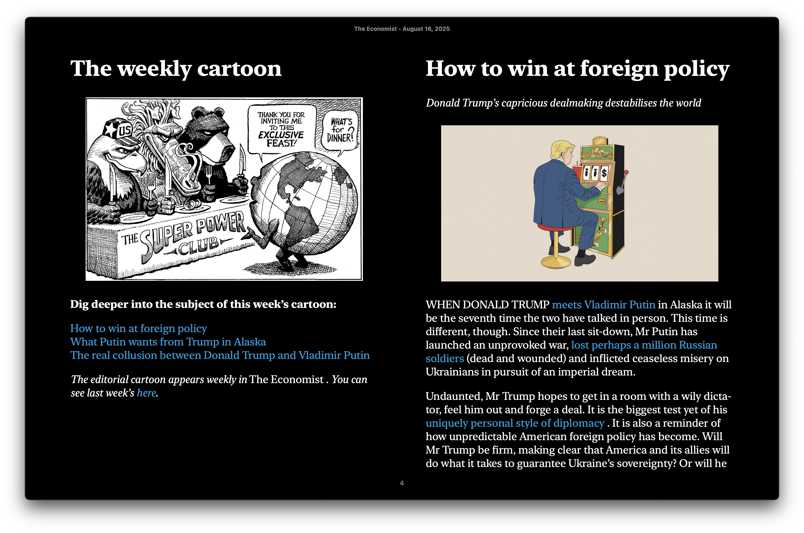

# 📰 Economister

*Transform The Economist weekly edition into EPUB files for offline reading on any e-reader.* **⚠️ Requires an active Economist subscription**

## ✨ Features

- 📚 **Complete Weekly Edition** - All 50+ articles from the current issue
- 🗂️ **Hierarchical Table of Contents** - Organized by sections (Leaders, Business, Science, etc.)
- 🖼️ **Full Image Support** - High-resolution images, charts, and the magazine cover
- 📖 **Professional Formatting** - Preserves italics, bold text, blockquotes, and typography
- 🎨 **Economist Styling** - Matches the magazine's classic design and readability
- 📱 **Universal Compatibility** - Works on Kindle, Kobo, iPad, and all EPUB readers
- 🔍 **Smart Content Extraction** - Filters out ads, navigation, and duplicate content
- 📊 **Detailed Metadata** - Publication date, article count, and reading statistics



## 🚀 How It Works

Economister uses a simple yet effective approach: it opens a browser for you to log in manually (bypassing all bot detection), then automatically downloads and converts the entire weekly edition:

1. **Chrome Opens** → A Chrome browser window appears
2. **You Log In** → Manually log in to The Economist (handle any CAPTCHAs/2FA)
3. **Press Enter** → In the terminal, press Enter to continue
4. **Tool Takes Over** → Downloads all articles and creates EPUB
5. **EPUB Ready** → Find your file in `ebooks/economist_YYYY-MM-DD.epub`

## Prerequisites

- **Python 3.7+**
- **Google Chrome Browser** (must be installed - Selenium controls it but doesn't install it)
- **Active Economist Subscription**

## Quick Start

```bash
# 1. Clone and enter directory
git clone https://github.com/yourusername/economister.git
cd economister

# 2. Install Python dependencies
pip install -r requirements.txt

# 3. Install ChromeDriver (required for Selenium)
# macOS:
brew install chromedriver

# Ubuntu/Debian:
sudo apt-get install chromium-chromedriver

# Windows:
# Download from https://chromedriver.chromium.org
# Add to PATH or place in project directory

# 4. Run the tool
python src/main.py  # Modular version
```

## Project Structure

```
src/
├── main.py              # Main entry point
├── config.py            # Configuration and constants
├── models.py            # Data models (Article, Edition, etc.)
├── browser.py           # Browser management with Selenium
├── content_extractor.py # HTML parsing and content extraction
├── scraper.py           # Main scraping orchestrator
├── epub_builder.py      # EPUB file generation
├── image_handler.py     # Image downloading and processing
└── utils.py             # Utility functions
```

# Input/Output

```bash
# Download current weekly edition (50+ articles)
python src/main.py

# Quick test with 5 articles from current edition
python src/main.py --limit 5

# Debug mode (saves HTML files)
python src/main.py --debug
```

**Note**: All commands download from the current weekly edition only. There is no option to specify past editions.

Example output from running this would be:

```txt
============================================================
✅ EPUB CREATED SUCCESSFULLY!
============================================================
📖 Edition: The Economist - August 16, 2025
📚 Articles: 62
📑 Sections: 16
📄 Est. Pages: ~310
🖼️  Images: 92
💾 File Size: 21.66 MB
📁 Location: ebooks/economist_2025-08-16.epub
============================================================
```


## Troubleshooting

### ChromeDriver Issues
```bash
# Check Chrome version
google-chrome --version  # or chrome --version

# Download matching ChromeDriver version from:
# https://chromedriver.chromium.org/downloads
```

### Login Problems
- Complete any CAPTCHAs that appear
- Handle 2FA if enabled
- Wait for page to fully load before pressing Enter
- Don't close the browser window

### Missing Articles
- Some special reports may require different selectors
- Run with `--debug` to analyze HTML
- Check `debug/` folder for saved pages

## Why Manual Login?

The Economist uses advanced bot detection (CAPTCHAs, behavior analysis, browser fingerprinting). Every automated login method we tried was blocked:
- ❌ Selenium automation → Detected as bot
- ❌ Playwright automation → Blocked by CAPTCHAs  
- ❌ Cookie extraction → Session invalidated
- ❌ API login → 403 Forbidden
- ✅ **Manual login → Works every time!**

By letting you handle the login, we bypass all detection while maintaining a valid session for downloading articles.

## Legal

This tool requires a valid Economist subscription. It only formats content you already have access to for e-reader compatibility. The tool is strictly limited to the current weekly edition to ensure responsible use. See [doc/legal.md](doc/legal.md) for detailed legal analysis of format shifting rights with valid subscriptions.

## Contributing

See [LEARNINGS.md](LEARNINGS.md) for the complete development journey, including why we use manual login and how we solved various technical challenges.

**This tool is intentionally limited to downloading ONLY the current weekly edition.** The ability to target specific past editions or date ranges is not permitted and will not be implemented. This limitation ensures the tool:
- Respects The Economist's content distribution model
- Cannot be used to scrape their entire article library
- Remains focused on its intended purpose: format-shifting the current issue for e-reader compatibility

Other than that any contributions or modifications are allowed, so long as they adhere to:

- **Testing**: Run `python src/test.py` before submitting PRs
- **Code Style**: Follow Google Python Style Guide
- **Security**: Never commit credentials or bypass authentication


---

*For readers who value their time, their sources of information, and especially The Economist.*
